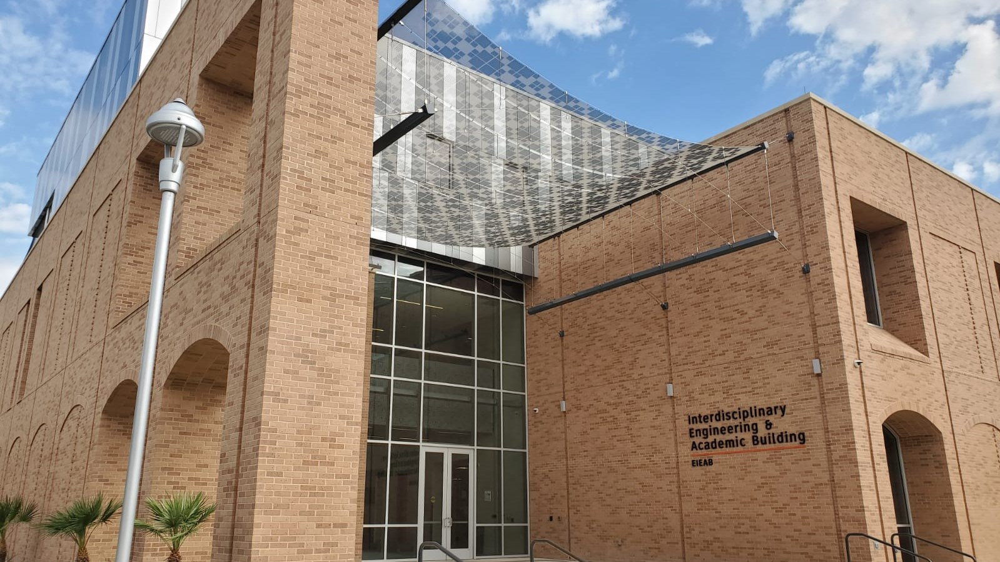

# Hello Vaqueros and welcome to CSCI 1170! :partying_face:

### Teacher Assistants:

   Charlie Ticer 
   
    Office hours: Mondays 2:15PM - 4:15PM
                  Wednesdays 2:15PM - 4:15PM
                  
    - Email: charlie.ticer01@utrgv.edu
    - Discord: secretply#6705
 

   Sonya Cirlos 
  
    Office hours: Wednesdays 10:00AM - 12:00PM 
                  Thursdays 2:00PM - 4:00PM
                  
    - Email: sonya.cirlos01@utrgv.edu
    - Discord: Sonya Cirlos#8146
  
## Agenda:

# Friday, 09/04

We will be working on Laboratory 1 and Laboratory 2. 
Criteria and files for these assignments can be found in Blackboard under 'Assignments'
 

# Friday, 08/27
Our lectures will be recorded and uploaded to Blackboard 

Today, we will review the tools we will be using for the laboratory this semester. 

- Join the [UTRGV Computer Science Discord](https://discord.gg/VNhhrrF) server: 

- [Visual Studio (Community edition)](https://visualstudio.microsoft.com/downloads/) --> Windows 

- [Xcode](https://apps.apple.com/us/app/xcode/id497799835?mt=12) or [Visual Studio Code (blue logo)](https://code.visualstudio.com/download) --> Mac            (:movie_camera:'how to' videos will be uploaded by next week)
 

 Note: If you are already familiar with a C++ compiling IDE, go ahead and use it for any out of laboratory assignments. Whatever is comfortable for you. We want to prepare you for future CS courses. 
 

:sparkles: For in Laboratory assignments: Please use Repl.it! :sparkles:

- [Repl.it](https://repl.it)

    - create new project C++ 
    - name your project
    - dedicate a workspace on your machine for this course for easy access and set it as project workspace
    - dont really need a solution name
    - click 'create'
    
    - default program will pop up with tips on how to run a program (you will learn more later) 
    - look at the left hand side there are your files in your workspace
    
    
   Next week, we will go through: 
     - Uploading a program
     - Run program 
     - Learn interaction features with TAs
         - How to show TAs your code:
           - during lab sessions
           - assignment submission
                  
### :movie_camera: Still need to upload VScode for Mac users!

           
### Send us a message if you have any questions!  

